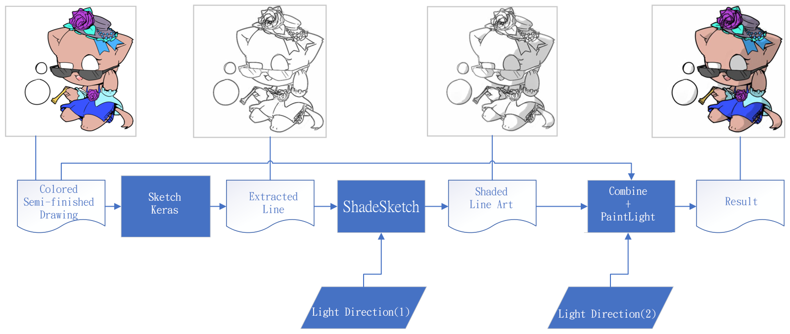

# ColorShadingFrame

A combine of [ShadeSketch](https://github.com/qyzdao/ShadeSketch "ShadeSketch"), [SketchKeras](https://github.com/lllyasviel/sketchKeras "SketchKeras"), and [PaintingLight](https://github.com/lllyasviel/PaintingLight "PaingLight") to deal a proroblem that ShadeSketch can't deal with colored Image.

## Requirement and how to use it
### requirements
All you need is in requirements.txt, use windows and conda to built enviroment, or you can install those packages by yourself:
* Python3.8
* tensorFlow 2.6.0
* keras
* numpy
* scipy
* matplotLib
* ipywidgets
* scikti-image
* opencv-python
* opencv-contrib-python
* trimesh
* rtree

### how to use
1. Download my code.
3. Download the following weights and place them in the project's models folder:  
    1. [For ShadeSketch](https://drive.google.com/drive/folders/1KUVw5OXCzc9CVVSg7EnEvYpTOJbCTMUo)
    2. [For SketchKeras](https://github.com/lllyasviel/sketchKeras/releases/tag/0.1): donload mod.h5 and rename it as "SketchKerasMod.h5"
4. Put your image to "test_image" folder, or any folder you like
5. run "auto_runner.ipynb", There are some instructions inside
6. output is in "output_image" folder    
## Demo
|| input | output |
|-------|-------|--------|
|1      |      |       |
|2      |      |       |
|3      |      |      |

Art by:[Me](https://www.pixiv.net/users/7486645 "Me") (Yes, I can draw, and I want you to see my drawings, so that there will be no copyright problems...... right?)

## Acknowledgements
 - [ShadeSketch](https://github.com/qyzdao/ShadeSketch)
 - [SketchKeras](https://github.com/lllyasviel/sketchKeras)
 - [PaintingLight](https://github.com/lllyasviel/PaintingLight)

## FAQ

#### Why this? I mean, out there has a stable diffusion right?

Yeah, I didn't have that when I was doing my master's degree in this stuff.

#### Those light parameters ....... I don't know what they mean.
Here you go:
* [For PaintingLight](https://github.com/lllyasviel/PaintingLight). Go to the FAQ and see how they work.
* I'll put up the ShadeSketch instructions later
#### How to connect you?

Just sent email bbplay110@gmail.com 

